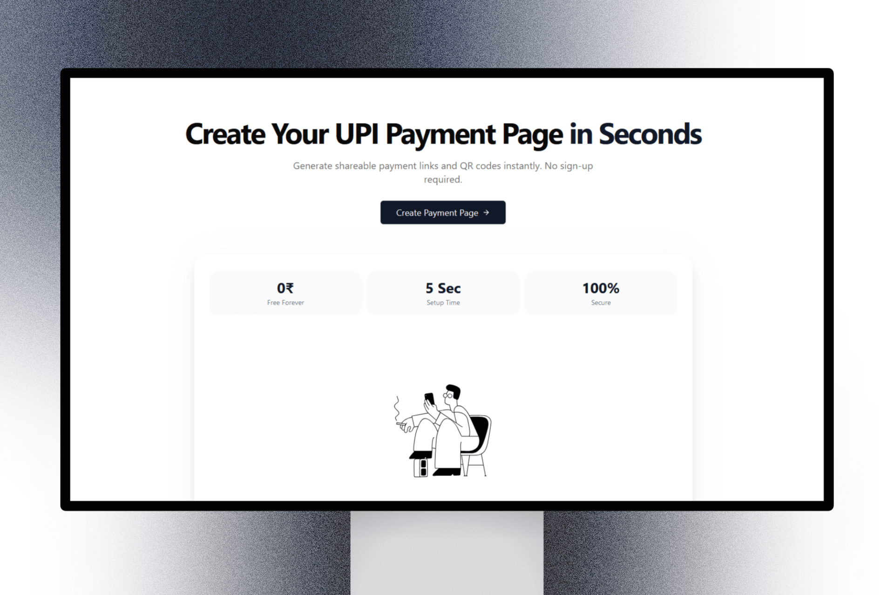

# UPI Link - Instant UPI Payment Pages

  

## Overview

UPI Link is a modern web application that allows users to create instant UPI payment pages with QR codes. No registration required, completely free, and works with all UPI apps.

## Features

- 🚀 **Instant Setup** - Create payment page in 5 seconds
- 💰 **Free Forever** - No hidden charges or fees
- 🔒 **Secure** - Direct UPI payments, no data storage
- 📱 **Universal Support** - Works with all UPI apps
- 🌐 **Shareable Links** - Easy to share payment pages
- 📲 **PWA Support** - Install as mobile app

## Tech Stack

- React + TypeScript
- Vite
- Tailwind CSS
- Framer Motion
- Docker
- ArgoCD